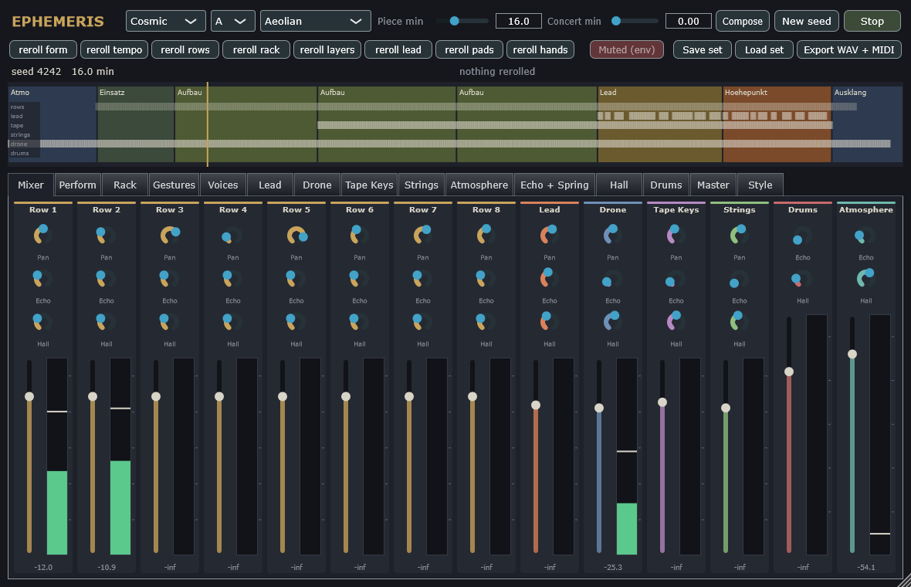
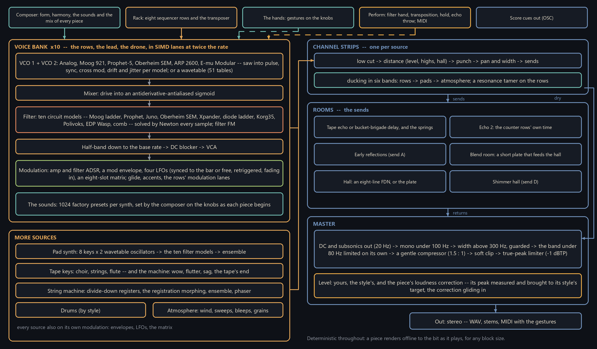
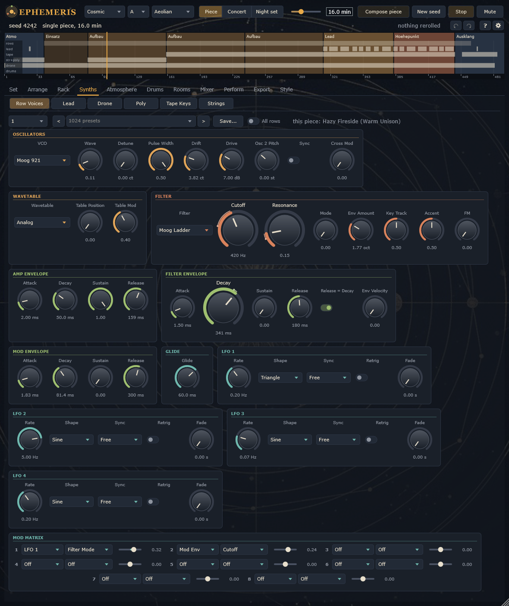
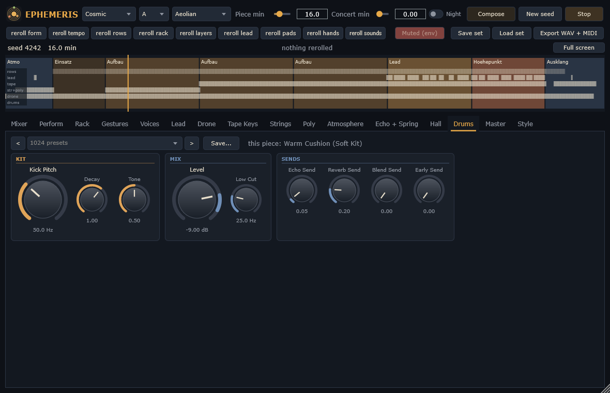
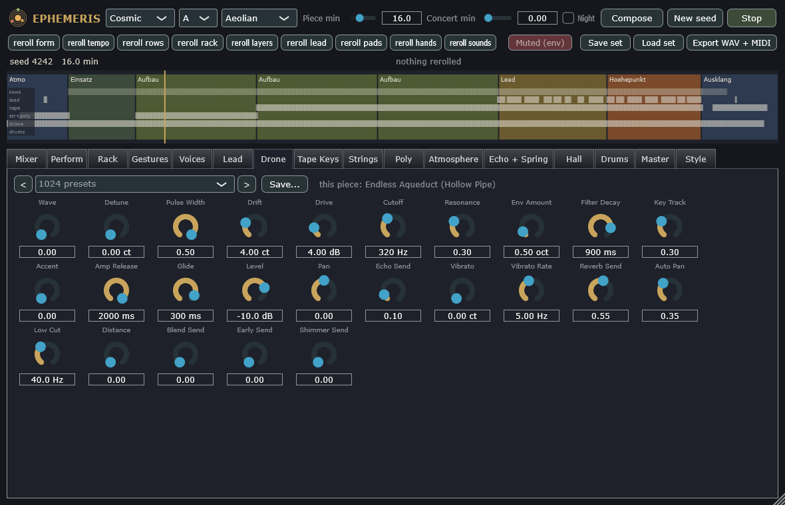
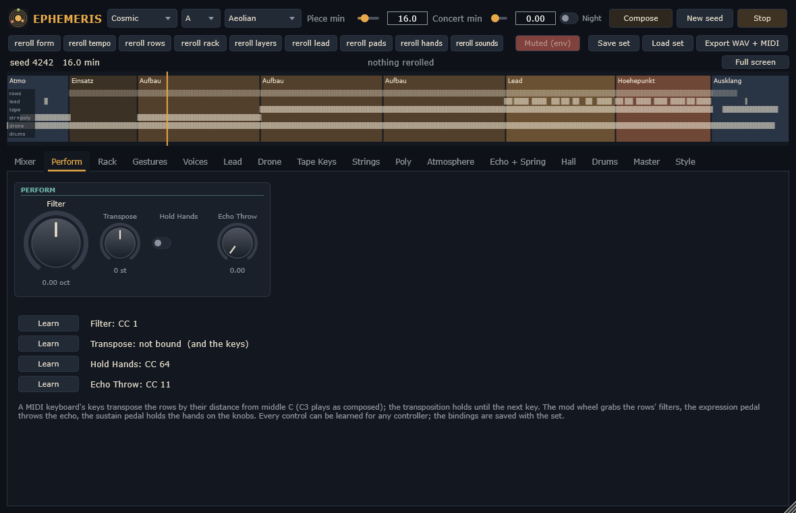

# Ephemeris

A generator of Berlin School music: long pieces, whole concerts and night sets, composed and played by the program
itself -- sequencer rows of different lengths turning against each other over a common root, a bass that holds the
ground, tape choirs and string machines, a lead that sings over the peak, the hands of a player on the filters, and
the room of a tape echo and a long hall. Everything is synthesised; nothing is played back from a recording.

**VST3 plugin and standalone application** for Windows (x64), and a native app for **Meta Quest**. Licence: AGPL-3.0.

<br clear="left" />



## Download

**[Ephemeris-1.1.0-Setup.exe](https://github.com/reneweller-coding/Ephemeris/releases/download/v1.1.0/Ephemeris-1.1.0-Setup.exe)**
installs the standalone, the VST3, the offline renderer and the manual. Nothing else has to be installed: the runtime
is linked in. There is a
**[portable zip](https://github.com/reneweller-coding/Ephemeris/releases/download/v1.1.0/Ephemeris-1.1.0-portable.zip)**
for anyone who would rather not run an installer, the
**[Quest app](https://github.com/reneweller-coding/Ephemeris/releases/download/v1.1.0/EphemerisQuest-1.1.0.apk)**
(installed with `adb install -r`, developer mode), and the
**[manual](https://github.com/reneweller-coding/Ephemeris/releases/download/v1.1.0/Ephemeris-Manual.pdf)** -- every
page of the panel as a picture, what each control does, and why it is built the way it is.

Requirements: Windows 10 or 11, a 64-bit processor with AVX2 (every x86-64 since 2013), and a VST3 host if you want
the plugin; Meta Quest 2 or later for the app. The installer is not code-signed: Windows' SmartScreen may warn once.

## How it is put together



## The composer

* **Pieces, concerts, night sets.** Five styles -- Cosmic, Doom, Melodic, Modern, Drift -- and one of your own, each a
  profile of tempo, form, layers, darkness and loudness. A piece is a seed: the same seed gives the same piece, sample
  for sample. Concerts morph from one style to another along an arc of tension; night sets overlap their pieces as a
  DJ mixes two tracks.
* **Form and harmony after the modern Berlin School.** Atmosphere, entry, builds that end where the rows meet again,
  the lead's section, the peak, breaks, bridges and the coda; a chord track the bass follows under the unchanged
  sequence, sequencer transpositions, parallel changes of mode, eight modes.
* **The rack.** Eight rows of different lengths and steps and a transposer row; sequence archetypes, probability
  gates, ratchets, a doubled pulse, a pattern that loses its steps in the breakdown; two modulation lanes per row that
  move the timbre against the notes.
* **The moves.** A player's two hands, never more: the filters opening towards the peak and closing in the coda, the
  echo thrown now and then, the wind rising and falling -- as offsets on the knobs you set.
* **The sounds and the mix.** 1024 factory presets per synth, most of them with modulation; the composer chooses them
  for every piece and sets them, with the piece's mix, on the knobs themselves -- the pages show what plays, and a
  knob you turn moves from there.
* **Every piece as loud as its style means:** its loudest part measured and brought to its style's level -- while
  the piece already plays, the correction gliding in.
* **Reroll any part on its own** -- form, tempo, rows, rack, layers, lead, pads, moves, sounds -- save a piece as a
  small set file, export WAV (with stems) and MIDI.

## The instruments

* **Ten modular voices** -- the eight rows, the lead and the drone -- running side by side in the SIMD lanes of the
  processor at twice the sample rate: two oscillators after one of six designs (the voices' own, Moog 921,
  Prophet-5, Oberheim SEM, ARP 2600, E-mu Modular) with hard sync and cross modulation, band-limited by BLEP and BLAMP;
  or a wavetable; a driven mixer; one of **ten filters solved as their circuits** -- the Moog ladder, the Prophet's and
  the Juno's cascades, the Oberheim SEM, the Xpander's pole mixing, the diode ladder, the Korg35, the Polivoks, the EDP
  Wasp, a comb -- by Newton-Raphson every sample.
* **Modulation on every synth:** full ADSRs for amplitude and filter, a mod envelope, four LFOs (synced to the bar or
  free, retriggered, fading in) and an eight-slot matrix.
* **A polyphonic wavetable pad synth** (51 tables: formulas, the PPG's, the classic VCOs' waves, sampled single
  cycles), **a tape keyboard** (choir, strings, flute -- and the machine: wow, flutter, sag, the tape's end), **a string
  machine** after the Streichfett, drums for the styles that have them, and an atmosphere of wind, sweeps, bleeps and
  grains.

## Rooms and mix

Tape echo or a bucket-brigade delay, springs, a second echo for the counter rows, early reflections, a blend room
that feeds an eight-line FDN hall (or a plate), a shimmer hall. A mix after a production guide for depth and
clarity: a distance per source (level, highs and hall together), cascaded ducking in six bands, a resonance tamer, the
bass mono under 100 Hz, a guarded width, a gentle compressor, a soft clipper and a true-peak limiter at -1 dBTP.

## The pages

| | |
|---|---|
|  |  |
| A row's voice: VCO, filter, envelopes, LFOs, matrix | The mixer: a strip per source, the composer's mix on the faders |
|  |  |
| The pad synth | The rerolls and the moves over the whole piece |

The panel is the family's (Phosphene, Totality, Parhelion and, in part, Noctuary): the same header, the same order
of the tabs, the same keys (Space, Ctrl+Z / Ctrl+Y, F1, F11), the same controllers (74 the filters, 11 the echo throw,
64 Hold Moves) and the same hands on a Meta Quest -- whose controls show only while a headset sends them.

The plan, the musical specification and the literature behind each building block are in
[docs/PLAN.md](docs/PLAN.md) (German); the manual is built out of the program itself
([docs/manual](docs/manual/Ephemeris-Manual.pdf)).

## Build

The same in every instrument of the family (`build.ps1`, `CMakePresets.json`, `cmake/Family.cmake`):

```powershell
.\build.ps1               # Visual Studio's compiler, Release: build\msvc (the solution), the programs in bin\msvc
.\build.ps1 icx           # Intel's oneAPI compiler: build\icx, the programs in bin\icx
.\build.ps1 msvc -Test    # and the tests (ctest)
.\build.ps1 icx -Run      # and start the standalone
.\build.ps1 quest         # the Meta Quest app: bin\quest\EphemerisQuest.apk
```

| Folder | What is in it |
|---|---|
| `bin\msvc`, `bin\icx` | what can be started: the standalone, the VST3, the renderer (and the files they read) |
| `build\<preset>` | the build trees -- `build\msvc\Ephemeris.slnx` for Visual Studio |
| `dist\` | the release: setup, portable zip, checksums (`Deploy\build_release.ps1`, from `build\release`) |
| `work\` | local data, renders and logs, never in git |

Without the script: `cmake --preset msvc`, `cmake --build --preset msvc`, `ctest --preset msvc`; the icx presets need
Visual Studio's and oneAPI's environment, which `build.ps1` sets up.

`EPH_MUTE=1` starts the standalone or the plugin muted (the screenshot mode `EPH_SHOT` does as well); every
automated run uses it.

## Try it

```bash
bin/msvc/eph_render.exe --minutes 14 --seed 11 --set "compose.style=Cosmic" --out work/renders/piece.wav --midi work/renders/piece.mid
bin/msvc/eph_render.exe --concert 60 --seed 3 --set "compose.style=Drift" --out work/renders/night.wav
bin/msvc/eph_render.exe --set-file work/renders/piece.ephset --reroll lead --save-set work/renders/piece2.ephset
bin/msvc/eph_render.exe --list
```

## Tools

| | |
|---|---|
| `Tools/manual/make_manual.py` | the manual out of the program: prose (`chapters.txt`), parameter tables (`eph_render --dump-params`), screenshots |
| `Tools/analyze_ref.py` | statistics of reference recordings (tempogram, row lengths, filter sweeps, levels); the audio never enters the project |
| `Deploy/build_release.ps1` | release build (Intel's icx where oneAPI is installed, else MSVC): static runtime, tests, pluginval, manual, stage, checks, optional signing, portable zip, Inno Setup installer |
| `Deploy/publish_release.ps1` | the GitHub release: tag, installer, portable zip, Quest APK, release notes |
| `eph_bench` (Tests/bench.cpp) | the voice bank's and the pad synth's cost per second of audio |
| `Quest/build_apk.ps1` | the Quest APK without Gradle (see [Quest/README.md](Quest/README.md)) |

## Updates

Once a day the program asks GitHub's releases whether a newer version is out and shows it in the status row as a link
to its page; nothing else is sent, nothing is downloaded. "Update check" in the status row turns it off.

## Licence

AGPL-3.0, as Noctuary and Phosphene. Some modules are copied from
[Phosphene](../PsytranceGenerator) and name their origin and commit in their file header.
